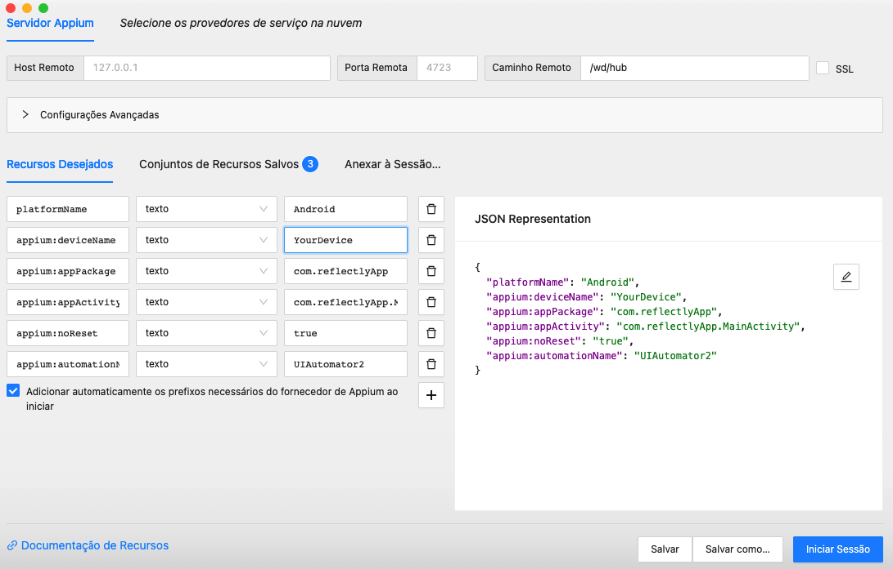

# Reflectly App Automation with Robot Framework and Appium

This project is designed for running automated end-to-end acceptance tests on the front-end of the Reflectly app using Robot Framework and Appium technologies. The tests can be executed both locally and within a CI/CD pipeline.

## Robot and Appium Template
> A repository of tests dedicated to utilizing various Robot Framework libraries with Appium.

## Environment Setup

### Install Python 3.12

Make sure you have Python 3.12 installed on your system. You can download it from the [official Python website](https://www.python.org/).

### Clear pip cache

pip cache remove *

### Deactivate Virtual Environment

deactivate

### Install Python Dependencies
First, activate the virtual environment to avoid version conflicts with other installed libraries.

pip install -r requirements.txt

### Install nvm:
This is necessary to switch the Node version used in the project.

https://github.com/nvm-sh/nvm/blob/master/README.md

### Install Node.js:
When installing, various additional packages may be installed, such as Chocolatey, etc.

https://nodejs.org/en/download

### Set the default Node version to the one used in the project:

nvm use

### Install Appium and Requirements

npm run appiumdriver

### Inspect App Elements
Download the Appium Inspector; version 2023.12.2 was used in this project.

https://github.com/appium/appium-inspector/releases

### Configure Appium Inspector
The settings for inspecting on Android should look similar to these:

### Code Linting

robotidy src

---

### ---- Project Highlights ----

- Page Object Model
- Robot Framework Integration
- Appium for Mobile Testing
- Data Management
- Report Generation

---

### ---- Mobile Testing Prerequisites (APP) ----
- Installation and Setup Guide: [YouTube Video](https://www.youtube.com/watch?v=W5hcHbzTjOc)
- Required: Java JDK 8, Android Studio, Java SDK, System Environment Variables, webdriver.io (dependency).
- Important: Update the environment variable from `%ANDROID_HOME%/build-tools` to `%ANDROID_HOME%\platform-tools`.
- Start the device using the AVD Manager in Android Studio or connect a mobile phone via USB and enable USB debugging.
- Commands to establish a connection with Appium: `appium`, `adb kill-server`, `adb start-server`, `adb devices`.
- Additional helpful videos: [Video 1](https://www.youtube.com/watch?v=QYT0_qgkiCw) / [Video 2](https://www.youtube.com/watch?v=0a5NAJjUBbA)

### ---- Commands to Run Tests on the APP: ----

*Note: To run the tests with Appium, you must first <u>initialize the device via the AVD Manager</u> in Android Studio.*

**Start Appium**

npm run appium

**Check Available Devices in ADB**

adb devices

**List Installed Emulators**

emulator -list-avds

**Execute Regression Tests**

npm run test

### EXTRAS
- [Appium Workshop](https://eliasnogueira.github.io/appium-workshop/)
- [Robot Framework Appium Library Documentation](https://serhatbolsu.github.io/robotframework-appiumlibrary/AppiumLibrary.html#Open%20Application)

---
